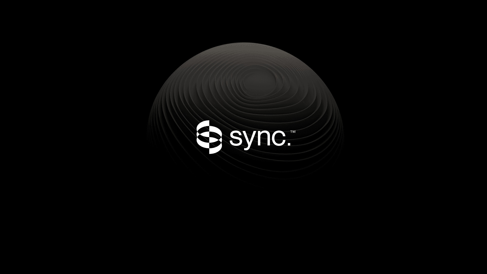

<div align="center">

[](https://synclabs.so)

# [Sync. labs](https://synclabs.so)<a id="sync-labs"></a>

Synchronize API allows you to lipsync a video to any audio in any language.

</div>

## Table of Contents<a id="table-of-contents"></a>

<!-- toc -->

- [Installation](#installation)
- [Getting Started](#getting-started)
- [Reference](#reference)
  * [`synclabs.animate.animate`](#synclabsanimateanimate)
  * [`synclabs.animate.animateCost`](#synclabsanimateanimatecost)
  * [`synclabs.animate.getAnimation`](#synclabsanimategetanimation)
  * [`synclabs.lipsync.getLipsync`](#synclabslipsyncgetlipsync)
  * [`synclabs.lipsync.lipSync`](#synclabslipsynclipsync)
  * [`synclabs.lipsync.lipsyncCost`](#synclabslipsynclipsynccost)
  * [`synclabs.speak.getSpeech`](#synclabsspeakgetspeech)
  * [`synclabs.speak.speak`](#synclabsspeakspeak)
  * [`synclabs.speak.speakCost`](#synclabsspeakspeakcost)
  * [`synclabs.translate.getTranslation`](#synclabstranslategettranslation)
  * [`synclabs.translate.translate`](#synclabstranslatetranslate)
  * [`synclabs.translate.translationCost`](#synclabstranslatetranslationcost)
  * [`synclabs.video.cost`](#synclabsvideocost)
  * [`synclabs.video.getLipSyncJob`](#synclabsvideogetlipsyncjob)
  * [`synclabs.video.lipSync`](#synclabsvideolipsync)
  * [`synclabs.voices.voices`](#synclabsvoicesvoices)

<!-- tocstop -->

## Installation<a id="installation"></a>
<div align="center">
  <a href="https://konfigthis.com/sdk-sign-up?company=sync.%20labs&language=TypeScript">
    
  </a>
</div>

## Getting Started<a id="getting-started"></a>

```typescript
import { SyncLabs } from "sync-labs-typescript-sdk";

const synclabs = new SyncLabs({
  // Defining the base path is optional and defaults to https://api.synclabs.so
  // basePath: "https://api.synclabs.so",
  apiKey: "API_KEY",
});

const animateResponse = await synclabs.animate.animate({
  videoUrl: "videoUrl_example",
  transcript: "transcript_example",
  voiceId: "voiceId_example",
  model: "sync-1.5.0",
});

console.log(animateResponse);
```

## Reference<a id="reference"></a>


### `synclabs.animate.animate`<a id="synclabsanimateanimate"></a>

Generates audio given inputted text and voice and synchronizes with the given video.

#### 🛠️ Usage<a id="🛠️-usage"></a>

```typescript
const animateResponse = await synclabs.animate.animate({
  videoUrl: "videoUrl_example",
  transcript: "transcript_example",
  voiceId: "voiceId_example",
  model: "sync-1.5.0",
});
```

#### ⚙️ Parameters<a id="⚙️-parameters"></a>

##### videoUrl: `string`<a id="videourl-string"></a>

A url to the video file to be synchronized -- must be publicly accessible

##### transcript: `string`<a id="transcript-string"></a>

A string of text to be spoken by the AI

##### voiceId: `string`<a id="voiceid-string"></a>

The voice to use for audio generation

##### model: `string`<a id="model-string"></a>

The model to use for video generation

##### maxCredits: `number`<a id="maxcredits-number"></a>

Maximum number of credits to use for audio generation. If job exceeds this value, the job will be aborted

##### webhookUrl: `string`<a id="webhookurl-string"></a>

A url to send a notification to upon completion of audio generation

#### 🔄 Return<a id="🔄-return"></a>

[AnimateInitial](./models/animate-initial.ts)

#### 🌐 Endpoint<a id="🌐-endpoint"></a>

`/animate` `POST`

[🔙 **Back to Table of Contents**](#table-of-contents)

---


### `synclabs.animate.animateCost`<a id="synclabsanimateanimatecost"></a>


#### 🛠️ Usage<a id="🛠️-usage"></a>

```typescript
const animateCostResponse = await synclabs.animate.animateCost({});
```

#### ⚙️ Parameters<a id="⚙️-parameters"></a>

##### transcript: `string`<a id="transcript-string"></a>

A string of text to be spoken by the AI

##### transcriptUrl: `string`<a id="transcripturl-string"></a>

A url pointing to a file of text to be spoken by the AI

#### 🌐 Endpoint<a id="🌐-endpoint"></a>

`/animate/cost` `GET`

[🔙 **Back to Table of Contents**](#table-of-contents)

---


### `synclabs.animate.getAnimation`<a id="synclabsanimategetanimation"></a>

Use the ID from the POST request to check status. Keep checking until status is 'completed' and a download URL is provided.

#### 🛠️ Usage<a id="🛠️-usage"></a>

```typescript
const getAnimationResponse = await synclabs.animate.getAnimation({
  id: "id_example",
});
```

#### ⚙️ Parameters<a id="⚙️-parameters"></a>

##### id: `string`<a id="id-string"></a>

#### 🔄 Return<a id="🔄-return"></a>

[AnimateExtended](./models/animate-extended.ts)

#### 🌐 Endpoint<a id="🌐-endpoint"></a>

`/animate/{id}` `GET`

[🔙 **Back to Table of Contents**](#table-of-contents)

---


### `synclabs.lipsync.getLipsync`<a id="synclabslipsyncgetlipsync"></a>

Use the video ID from the POST request to check video status. Keep checking until status is 'completed' and a download URL is provided.

#### 🛠️ Usage<a id="🛠️-usage"></a>

```typescript
const getLipsyncResponse = await synclabs.lipsync.getLipsync({
  id: "id_example",
});
```

#### ⚙️ Parameters<a id="⚙️-parameters"></a>

##### id: `string`<a id="id-string"></a>

#### 🔄 Return<a id="🔄-return"></a>

[LipSyncExtended](./models/lip-sync-extended.ts)

#### 🌐 Endpoint<a id="🌐-endpoint"></a>

`/lipsync/{id}` `GET`

[🔙 **Back to Table of Contents**](#table-of-contents)

---


### `synclabs.lipsync.lipSync`<a id="synclabslipsynclipsync"></a>

Submit a set of urls to publically hosted audio and video files or to YouTube videos. Our synchronizer will sync the video's lip movements to match the audio and return the synced video.

#### 🛠️ Usage<a id="🛠️-usage"></a>

```typescript
const lipSyncResponse = await synclabs.lipsync.lipSync({
  audioUrl: "audioUrl_example",
  videoUrl: "videoUrl_example",
  synergize: true,
  model: "sync-1.5.0",
});
```

#### ⚙️ Parameters<a id="⚙️-parameters"></a>

##### audioUrl: `string`<a id="audiourl-string"></a>

A url to the audio file to be synchronized -- must be publicly accessible

##### videoUrl: `string`<a id="videourl-string"></a>

A url to the video file to be synchronized -- must be publicly accessible

##### synergize: `boolean`<a id="synergize-boolean"></a>

A flag to enable / disable post-processing

##### maxCredits: `number`<a id="maxcredits-number"></a>

Maximum number of credits to use for video generation. If job exceeds this value, the job will be aborted

##### webhookUrl: `string`<a id="webhookurl-string"></a>

A url to send a notification to upon completion of video generation

##### model: `string`<a id="model-string"></a>

The model to use for video generation

#### 🔄 Return<a id="🔄-return"></a>

[LipSyncInitial](./models/lip-sync-initial.ts)

#### 🌐 Endpoint<a id="🌐-endpoint"></a>

`/lipsync` `POST`

[🔙 **Back to Table of Contents**](#table-of-contents)

---


### `synclabs.lipsync.lipsyncCost`<a id="synclabslipsynclipsynccost"></a>


#### 🛠️ Usage<a id="🛠️-usage"></a>

```typescript
const lipsyncCostResponse = await synclabs.lipsync.lipsyncCost({
  audioUrl: "audioUrl_example",
  videoUrl: "videoUrl_example",
});
```

#### ⚙️ Parameters<a id="⚙️-parameters"></a>

##### audioUrl: `string`<a id="audiourl-string"></a>

A url to the audio file to be synchronized -- must be publicly accessible

##### videoUrl: `string`<a id="videourl-string"></a>

A url to the video file to be synchronized -- must be publicly accessible

#### 🌐 Endpoint<a id="🌐-endpoint"></a>

`/lipsync/cost` `GET`

[🔙 **Back to Table of Contents**](#table-of-contents)

---


### `synclabs.speak.getSpeech`<a id="synclabsspeakgetspeech"></a>

Use the video ID from the POST request to check video status. Keep checking until status is 'completed' and a download URL is provided.

#### 🛠️ Usage<a id="🛠️-usage"></a>

```typescript
const getSpeechResponse = await synclabs.speak.getSpeech({
  id: "id_example",
});
```

#### ⚙️ Parameters<a id="⚙️-parameters"></a>

##### id: `string`<a id="id-string"></a>

#### 🔄 Return<a id="🔄-return"></a>

[SpeakExtended](./models/speak-extended.ts)

#### 🌐 Endpoint<a id="🌐-endpoint"></a>

`/speak/{id}` `GET`

[🔙 **Back to Table of Contents**](#table-of-contents)

---


### `synclabs.speak.speak`<a id="synclabsspeakspeak"></a>


#### 🛠️ Usage<a id="🛠️-usage"></a>

```typescript
const speakResponse = await synclabs.speak.speak({
  transcript: "transcript_example",
  voiceId: "voiceId_example",
});
```

#### ⚙️ Parameters<a id="⚙️-parameters"></a>

##### transcript: `string`<a id="transcript-string"></a>

A string of text to be spoken by the AI

##### voiceId: `string`<a id="voiceid-string"></a>

The voice to use for audio generation

##### maxCredits: `number`<a id="maxcredits-number"></a>

Maximum number of credits to use for audio generation. If job exceeds this value, the job will be aborted

##### webhookUrl: `string`<a id="webhookurl-string"></a>

A url to send a notification to upon completion of audio generation

#### 🔄 Return<a id="🔄-return"></a>

[SpeakInitial](./models/speak-initial.ts)

#### 🌐 Endpoint<a id="🌐-endpoint"></a>

`/speak` `POST`

[🔙 **Back to Table of Contents**](#table-of-contents)

---


### `synclabs.speak.speakCost`<a id="synclabsspeakspeakcost"></a>


#### 🛠️ Usage<a id="🛠️-usage"></a>

```typescript
const speakCostResponse = await synclabs.speak.speakCost({});
```

#### ⚙️ Parameters<a id="⚙️-parameters"></a>

##### transcript: `string`<a id="transcript-string"></a>

A string of text to be spoken by the AI

##### transcriptUrl: `string`<a id="transcripturl-string"></a>

A url pointing to a file of text to be spoken by the AI

#### 🌐 Endpoint<a id="🌐-endpoint"></a>

`/speak/cost` `GET`

[🔙 **Back to Table of Contents**](#table-of-contents)

---


### `synclabs.translate.getTranslation`<a id="synclabstranslategettranslation"></a>

Use the video ID from the POST request to check video status. Keep checking until status is 'completed' and a download URL is provided.

#### 🛠️ Usage<a id="🛠️-usage"></a>

```typescript
const getTranslationResponse = await synclabs.translate.getTranslation({
  id: "id_example",
});
```

#### ⚙️ Parameters<a id="⚙️-parameters"></a>

##### id: `string`<a id="id-string"></a>

#### 🔄 Return<a id="🔄-return"></a>

[TranslationJobExtended](./models/translation-job-extended.ts)

#### 🌐 Endpoint<a id="🌐-endpoint"></a>

`/translate/{id}` `GET`

[🔙 **Back to Table of Contents**](#table-of-contents)

---


### `synclabs.translate.translate`<a id="synclabstranslatetranslate"></a>

Translates and synchronizes the given video to the specified target language.

#### 🛠️ Usage<a id="🛠️-usage"></a>

```typescript
const translateResponse = await synclabs.translate.translate({
  videoUrl: "videoUrl_example",
  targetLanguage: "targetLanguage_example",
  model: "sync-1.5.0",
});
```

#### ⚙️ Parameters<a id="⚙️-parameters"></a>

##### videoUrl: `string`<a id="videourl-string"></a>

A url to the video file to be translated and synchronized -- must be publicly accessible

##### targetLanguage: `string`<a id="targetlanguage-string"></a>

Target language to translate the video to

##### maxCredits: `number`<a id="maxcredits-number"></a>

Maximum number of credits to use for video generation. If job exceeds this value, the job will be aborted

##### webhookUrl: `string`<a id="webhookurl-string"></a>

A url to send a notification to upon completion of video generation

##### model: `string`<a id="model-string"></a>

The model to use for video generation.

#### 🔄 Return<a id="🔄-return"></a>

[TranslationJobInitial](./models/translation-job-initial.ts)

#### 🌐 Endpoint<a id="🌐-endpoint"></a>

`/translate` `POST`

[🔙 **Back to Table of Contents**](#table-of-contents)

---


### `synclabs.translate.translationCost`<a id="synclabstranslatetranslationcost"></a>


#### 🛠️ Usage<a id="🛠️-usage"></a>

```typescript
const translationCostResponse = await synclabs.translate.translationCost({
  videoUrl: "videoUrl_example",
});
```

#### ⚙️ Parameters<a id="⚙️-parameters"></a>

##### videoUrl: `string`<a id="videourl-string"></a>

A url to the video file to be synchronized -- must be publicly accessible

#### 🌐 Endpoint<a id="🌐-endpoint"></a>

`/translate/cost` `GET`

[🔙 **Back to Table of Contents**](#table-of-contents)

---


### `synclabs.video.cost`<a id="synclabsvideocost"></a>


#### 🛠️ Usage<a id="🛠️-usage"></a>

```typescript
const costResponse = await synclabs.video.cost({
  audioUrl: "audioUrl_example",
  videoUrl: "videoUrl_example",
});
```

#### ⚙️ Parameters<a id="⚙️-parameters"></a>

##### audioUrl: `string`<a id="audiourl-string"></a>

A url to the audio file to be synchronized -- must be publicly accessible

##### videoUrl: `string`<a id="videourl-string"></a>

A url to the video file to be synchronized -- must be publicly accessible

#### 🌐 Endpoint<a id="🌐-endpoint"></a>

`/video/cost` `GET`

[🔙 **Back to Table of Contents**](#table-of-contents)

---


### `synclabs.video.getLipSyncJob`<a id="synclabsvideogetlipsyncjob"></a>

[Deprecated] Use the video ID from the POST request to check video status. Keep checking until status is 'completed' and a download URL is provided.

#### 🛠️ Usage<a id="🛠️-usage"></a>

```typescript
const getLipSyncJobResponse = await synclabs.video.getLipSyncJob({
  id: "id_example",
});
```

#### ⚙️ Parameters<a id="⚙️-parameters"></a>

##### id: `string`<a id="id-string"></a>

#### 🔄 Return<a id="🔄-return"></a>

[VideoExtended](./models/video-extended.ts)

#### 🌐 Endpoint<a id="🌐-endpoint"></a>

`/video/{id}` `GET`

[🔙 **Back to Table of Contents**](#table-of-contents)

---


### `synclabs.video.lipSync`<a id="synclabsvideolipsync"></a>

[Deprecated] Submit a set of urls to publically hosted audio and video files or to YouTube videos. Our synchronizer will sync the video's lip movements to match the audio and return the synced video.

#### 🛠️ Usage<a id="🛠️-usage"></a>

```typescript
const lipSyncResponse = await synclabs.video.lipSync({
  audioUrl: "audioUrl_example",
  videoUrl: "videoUrl_example",
  synergize: true,
  model: "sync-1.5.0",
});
```

#### ⚙️ Parameters<a id="⚙️-parameters"></a>

##### audioUrl: `string`<a id="audiourl-string"></a>

A url to the audio file to be synchronized -- must be publicly accessible

##### videoUrl: `string`<a id="videourl-string"></a>

A url to the video file to be synchronized -- must be publicly accessible

##### synergize: `boolean`<a id="synergize-boolean"></a>

A flag to enable / disable post-processing

##### maxCredits: `number`<a id="maxcredits-number"></a>

Maximum number of credits to use for video generation. If job exceeds this value, the job will be aborted

##### webhookUrl: `string`<a id="webhookurl-string"></a>

A url to send a notification to upon completion of video generation

##### model: `string`<a id="model-string"></a>

The model to use for video generation

#### 🔄 Return<a id="🔄-return"></a>

[VideoInitial](./models/video-initial.ts)

#### 🌐 Endpoint<a id="🌐-endpoint"></a>

`/video` `POST`

[🔙 **Back to Table of Contents**](#table-of-contents)

---


### `synclabs.voices.voices`<a id="synclabsvoicesvoices"></a>

Get all voices

#### 🛠️ Usage<a id="🛠️-usage"></a>

```typescript
const voicesResponse = await synclabs.voices.voices();
```

#### 🌐 Endpoint<a id="🌐-endpoint"></a>

`/voices` `GET`

[🔙 **Back to Table of Contents**](#table-of-contents)

---


## Author<a id="author"></a>
This TypeScript package is automatically generated by [Konfig](https://konfigthis.com)
